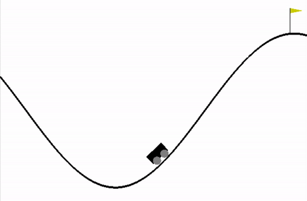
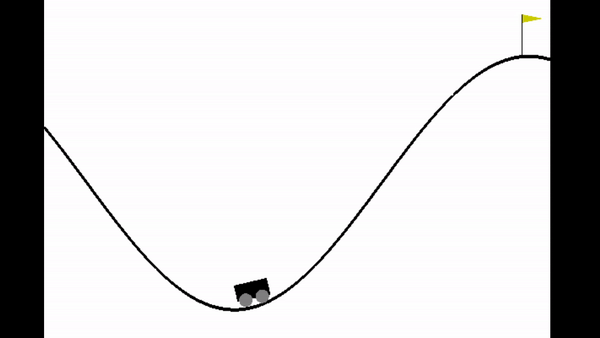
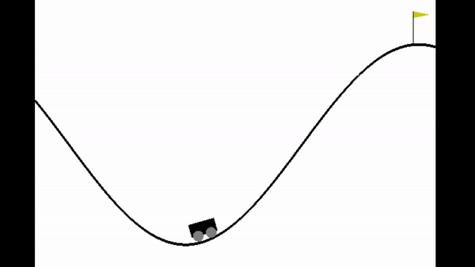

# MountainCar-v0 with Q-Learning and SARSA
---
This project contains the code to train an agent to solve the [OpenAI Gym Mountain Car environment](https://gym.openai.com/envs/MountainCar-v0/). Q-Learning and SARSA

## The Mountain Car Environment
---
  
The environment is two-dimensional and it consists of a car between two hills. The goal of the car is to reach a flag at the top of the hill on the right. The hills are too steep for the car to scale just by moving in the same direction, it has to go back and fourth to build up enough momentum to drive up.
### Observation Space:
The are two variables that determine the current state of the environment.
- The car position on the track, from -1.2 to 0.6
- The car velocity, from -0.07 to 0.07. Negative for left, and positive for right.
### Actions:
The car can take one of three different actions:
- Accelerate to the left
- Don't accelerate
- Accelerate to the right.
### Reward:
At each step, the car receives a reward based on the state it reached after that action:
- Reward of 0 is awarded if the agent reached the flag (position = 0.5) on top of the mountain.
- Reward of -1 is awarded if the position of the agent is less than 0.5.
### Starting State:
The car starts between the two mountains, in a random position between -0.6 and -0.4, with velocity equal to 0.
### Episode Termination:
The episode ends when the car reaches the flag (position > 0.5).
The episode may also terminate when it reaches the maximum number of steps (The original value is 200. Here we I used 1000 for training).

## Q-Learning
---
You can run the following line to run and render a pre-trained agent with Q-learning. It will run 10 for episodes.
```
python run_qlearning_agent.py
```
The agent was trained for 100000 episodes. Its Q-values are saved in the file pre-trained-Q-Learning.pkl, which can be loaded with the function load_obj() from the auxFunctions.py file.  

  
*Agent Trained using Q-Learning*  

To train a new agent you can run the following line:
```
python3 train_qlearning.py
```
It will train for 50000 episodes, with the following hyperparameters:
- learning rate (alpha) = 0.1
- the temporal difference discount factor (gamma) = 0.9

## SARSA
---
You can run the following line to run and render a pre-trained agent with Q-learning. It will run for 10 episodes.
```
python run_sarsa_agent.py
```
The agent was trained for 100000 episodes. Its Q-values are saved in the file pre-trained-SARSA.pkl, which can be loaded with the function load_obj() from the auxFunctions.py file.  

  

*Agent Trained using SARSA*  
To train a new agent you can run the following line:
```
python3 train_sarsa.py
```
It will train for 50000 episodes, with the following hyperparameters:
- learning rate (alpha) = 0.1
- the temporal difference discount factor (gamma) = 0.9
## Comparison  

  

## References
